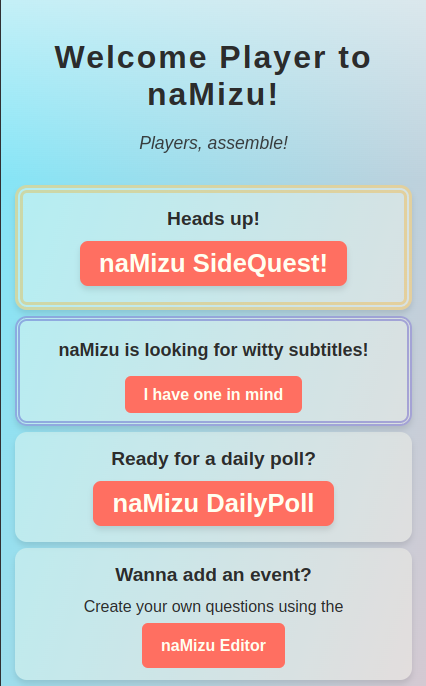

# naMizu App

  

naMizu daily poll app inspired by askUs.

## Introduction

naMizu is a free and open-source application based on askUs app.

## Apps

### naMizu Daily Poll app

You can vote and add comments for daily polls.

### naMizu Poll Editor app

You can create new polls in many categories.

### naMizu Sketcher app

You can draw a sketch and submit it, then you can see your artwork in the gallery.

[Documentation](./docs/Documentation.md)

[Manual](./docs/Manual.md)

