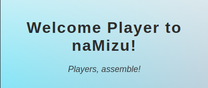
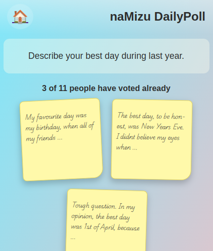
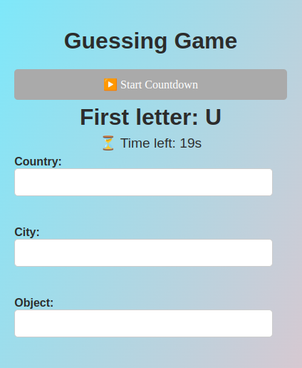
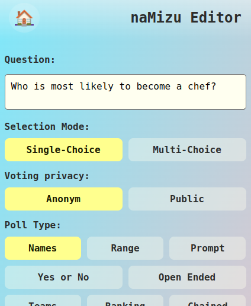
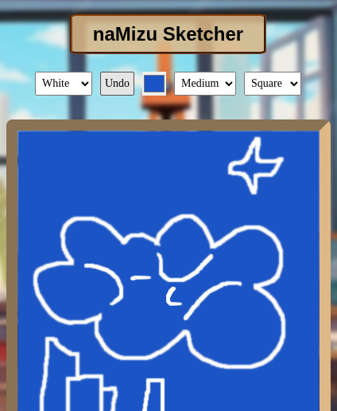
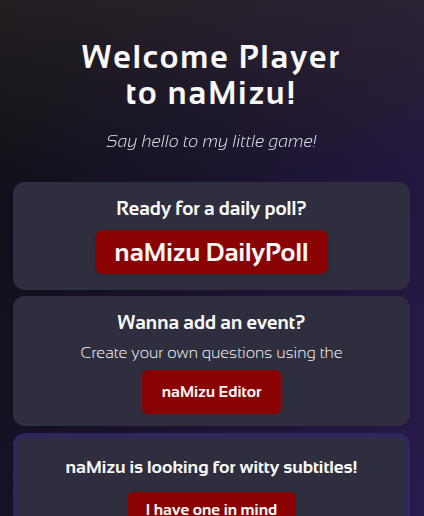

# 💬 naMizu App

  

## 📖 Introduction

naMizu is a free, open-source event-based web application, where community fun happens every day!

Participate in creative polls or create your own, and play with your friends! If you got inspired, draw sketches, or dive into story-based adventures or weekly challenges — all in a lively, friendly platform designed for you and your friends.

## 🚀 Key Features

**🗳️ Daily Polls: Vote, comment, and see community results.**

**🎮 Mini Games: fun sidequests, in form of e.g.: spelling bee, or hangman.**

**✍️ Poll Editor: Create custom polls across multiple categories.**

**🎨 Sketch & Submit: Draw and showcase your artwork.**

**🌙 Day/Night Themes: Automatic switching.**

**📜 Story Adventures: Participate in branching, D&D-style stories.** \
**💾 Daily Backups: Safe storage of your events and history.**

 

## 📱 Apps Overview

🗳️ naMizu Daily Poll App
: Vote and comment on fresh daily polls!

✍️ naMizu Poll Editor App
: Create and customize new polls across many dynamic categories.

🎨 naMizu Sketcher App
: Draw a sketch based on prompts and share your art in the community gallery.

## 📚 Full Documentation

- 📖 [Documentation](./docs/Documentation.md)
- 📔 [Manual](./docs/Manual.md)

## 🎯 Planned Features (v4+)

- 🔥 Full MySQL support
- 🖼️ Profile pictures for users
- 📱 Native Mobile App (ndroid & iOS)
- 🎮 More minigames and gamified SideQuests
- 📊 Advanced stats dashboard

## 🤝 Special Thanks

To all the contributors, friends, and early players who made naMizu possible!
This is your playground. 🎉

## 📥 How to Contribute

Want to help improve naMizu? Fork this repo, and extend the source code with many more fun features, or fix remaining issues.

---

© 2025 naMizu™. Version 3.0.1_alpha. \
Built together, played together.